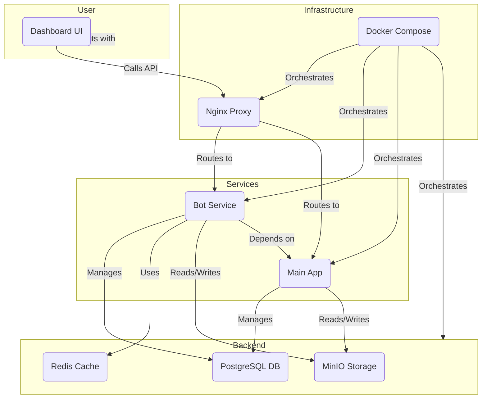

# ViewBot Platform: Comprehensive Context

## 1. High-Level Overview

**Purpose:** The ViewBot Platform is a sophisticated bot simulation system designed to automate content posting and simulate viral user engagement on a social media platform. It consists of a `bot` service that handles the core logic, an `app` service (which appears to be the main user-facing application, though not fully explored in this analysis), and a `shared` module for common utilities and database models.

**Main Technologies:**

*   **Backend:** Node.js, Express.js
*   **Database:** PostgreSQL with Sequelize ORM
*   **Caching:** Redis
*   **Object Storage:** MinIO
*   **Frontend (Dashboard):** HTML, CSS, Bootstrap, vanilla JavaScript, Chart.js
*   **Containerization:** Docker, Docker Compose
*   **Proxy:** Nginx

## 2. Directory Organization

The project is a monorepo managed with npm workspaces.

```
/
├── .env.example
├── docker-compose.yml       # Orchestrates all services
├── package.json             # Root package file, defines workspaces
├── bot/                     # Bot service and dashboard
│   ├── Dockerfile
│   ├── package.json
│   ├── public/              # Frontend dashboard files
│   └── src/                 # Bot service source code
│       ├── api/             # Express API routes and middleware
│       ├── config/          # Application configuration
│       ├── engine/          # Core logic for posting and analytics
│       └── utils/           # Utility functions
├── shared/                  # Shared code between services
│   └── database/
│       ├── migrations/
│       └── models/          # Sequelize models
├── docs/                    # Documentation
├── nginx/                   # Nginx configuration
└── scripts/                 # Utility scripts (e.g., seeding)
```

## 3. Critical Files and Their Roles

*   [`docker-compose.yml`](./docker-compose.yml:1): Defines the services (`nginx`, `app`, `bot`, `postgres`, `redis`, `minio`), their environments, volumes, and networks. It's the central piece for running the entire platform.
*   [`bot/src/index.js`](./bot/src/index.js:1): The main entry point for the `bot` service. It initializes the Express server, connects to the database, and starts the posting scheduler.
*   [`shared/database/models/index.js`](./shared/database/models/index.js:1): Initializes Sequelize, loads all database models, and sets up their associations.
*   [`bot/src/api/routes/index.js`](./bot/src/api/routes/index.js:1): The main router for the `bot`'s API, which delegates to specialized route files for different functionalities.
*   [`bot/src/engine/posting/scheduler.js`](./bot/src/engine/posting/scheduler.js:1): Manages cron jobs for automated posting based on configurations stored in the database.
*   [`bot/src/engine/analytics/analyticsService.js`](./bot/src/engine/analytics/analyticsService.js:1): Orchestrates viral growth simulations for media posts.
*   [`bot/public/dashboard/index.html`](./bot/public/dashboard/index.html:1): The main file for the admin dashboard, providing the user interface for managing the bot.

## 4. API Endpoints (Bot Service)

All protected routes require authentication. The API uses a `snake_case` to `camelCase` middleware for request/response bodies.

*   **Configuration (`/api/config`)**
    *   `GET /`: Get all bot configurations.
    *   `GET /:id`: Get a single configuration.
    *   `POST /`: Create a new configuration.
    *   `PUT /:id`: Update a configuration.
    *   `DELETE /:id`: Delete a configuration.
*   **Scheduler (`/api/scheduler`)**
    *   `GET /status`: Get the status of the posting scheduler.
    *   `POST /start`: Start the scheduler.
    *   `POST /stop`: Stop the scheduler.
    *   `POST /reload`: Reload scheduler configurations.
    *   `POST /trigger`: Trigger a posting job immediately for a given config.
*   **Simulation (`/api/simulation`)**
    *   `GET /`: Get all active simulations.
    *   `GET /:mediaId`: Get the status of a specific simulation.
    *   `POST /start`: Start a new viral simulation.
    *   `POST /:mediaId/stop`: Stop a simulation.
*   **Statistics (`/api/stats`)**
    *   `GET /activity`: Get bot activity statistics (e.g., posts over time).
    *   `GET /users`: Get statistics about bot users.
    *   `GET /simulations`: Get statistics about viral simulations.
    *   `GET /performance`: Get system performance metrics.
    *   `GET /realtime`: Get real-time analytics data.

## 5. Data Flow Patterns

1.  **Automated Posting:**
    *   The `PostingScheduler` runs cron jobs based on `BotConfig` entries in the database.
    *   When a job is triggered, the `PostingService` is called.
    *   The service selects a random bot `User`, authenticates, selects random media from the local filesystem, uploads it to MinIO, and creates a `Post` record in the database via the main application's API.
2.  **Viral Simulation:**
    *   A user starts a simulation via the dashboard, which calls the `/api/simulation/start` endpoint.
    *   The `AnalyticsService` creates a simulation managed by the `SimulationManager`.
    *   Periodically, `updateSimulations` is called, which uses the `MetricsCalculator` to determine the target views and likes based on a growth curve (linear, exponential, or sigmoid).
    *   The `AnalyticsService` then updates the `viewCount` and `likeCount` on the target `Post` and creates synthetic `View` and `Like` records to simulate real user engagement.

## 6. Key Components & Relationships (Mermaid Diagram)



## 7. Design Patterns & Conventions

*   **Monorepo:** The codebase is organized as a monorepo with multiple packages (`bot`, `shared`), allowing for easy code sharing and centralized dependency management.
*   **Service-Oriented Architecture (SOA):** The application is split into distinct services (`bot`, `app`) that communicate over the network, each with its own responsibilities.
*   **Singleton Pattern:** The `PostingScheduler` is implemented as a singleton to ensure only one instance is running.
*   **Dependency Injection (manual):** Services like `PostingService` are instantiated with configuration, allowing for easier testing and customization.
*   **RESTful API:** The `bot` service exposes a RESTful API for interacting with the system.
*   **Environment-based Configuration:** The application uses `.env` files and environment variables for configuration, allowing for different settings in development and production.