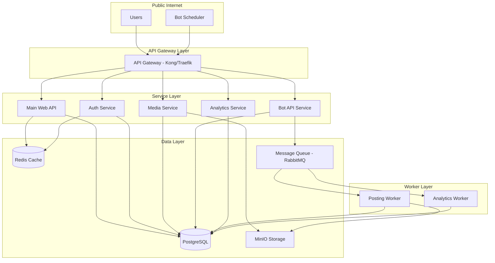
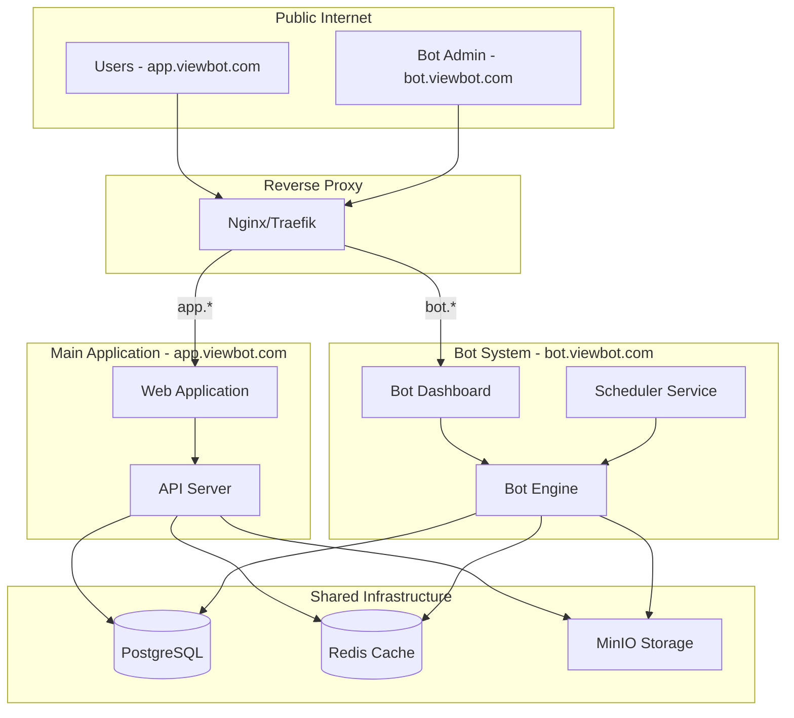

# ViewBot Architecture Implementation Plan

## Executive Summary

This document outlines two architectural approaches for implementing the ViewBot system described in the feature specification:
1. **Microservice Architecture with API Gateway**
2. **Subdomain Deployment Strategy**

Given your containerized Docker Compose setup, moderate microservices experience, and 10k+ concurrent user target, both approaches are viable with different trade-offs.

## Current State Analysis

- **Platform**: Containerized with Docker Compose
- **Architecture**: All services in single deployment
- **Experience**: Moderate microservices knowledge
- **Scale Target**: 10k+ concurrent users
- **Bot Requirements**: 
  - Simulate user posts
  - Manipulate analytics
  - Access existing APIs and database

---

## Approach 1: Microservice Architecture with API Gateway

### Overview
Separate the bot system into dedicated microservices behind an API gateway, maintaining clear service boundaries and independent scalability.

### Architecture Diagram



### Directory Structure

```
viewbot-platform/
├── docker-compose.yml
├── docker-compose.override.yml
├── .env.example
├── gateway/
│   ├── kong/
│   │   └── kong.yml
│   └── traefik/
│       └── traefik.yml
├── services/
│   ├── web-api/
│   │   ├── Dockerfile
│   │   ├── package.json
│   │   └── src/
│   ├── auth-service/
│   │   ├── Dockerfile
│   │   ├── package.json
│   │   └── src/
│   ├── media-service/
│   │   ├── Dockerfile
│   │   ├── package.json
│   │   └── src/
│   ├── bot-api/
│   │   ├── Dockerfile
│   │   ├── package.json
│   │   └── src/
│   │       ├── controllers/
│   │       ├── services/
│   │       └── models/
│   └── analytics-service/
│       ├── Dockerfile
│       ├── package.json
│       └── src/
├── workers/
│   ├── posting-worker/
│   │   ├── Dockerfile
│   │   ├── package.json
│   │   └── src/
│   │       ├── scheduler.js
│   │       ├── postingService.js
│   │       └── utils/
│   └── analytics-worker/
│       ├── Dockerfile
│       ├── package.json
│       └── src/
│           ├── analyticsService.js
│           ├── growthAlgorithm.js
│           └── config.js
├── shared/
│   ├── models/
│   ├── utils/
│   └── constants/
├── scripts/
│   ├── seedBotUsers.js
│   └── migration/
└── bot-media/
    ├── videos/
    └── images/
```

### Service Boundaries

#### 1. **Web API Service**
- Handles main website functionality
- User-facing endpoints
- Content browsing/interaction

#### 2. **Auth Service**
- Authentication/authorization
- JWT token management
- User session handling

#### 3. **Media Service**
- Media upload/download
- MinIO integration
- Pre-signed URL generation

#### 4. **Bot API Service**
- Bot orchestration endpoints
- Configuration management
- Monitoring/control interface

#### 5. **Analytics Service**
- View/like tracking
- Analytics queries
- Reporting endpoints

#### 6. **Posting Worker**
- Executes scheduled posts
- Simulates human behavior
- Media selection/upload

#### 7. **Analytics Worker**
- Implements viral growth algorithm
- Database manipulation
- S-curve simulation

### Data Access Patterns

```yaml
# Service-to-Database Mapping
services:
  web-api:
    - read/write: users, posts, comments
    - read: analytics
  
  auth-service:
    - read/write: users, sessions
    - read: permissions
  
  media-service:
    - read/write: media_metadata
    - external: MinIO
  
  bot-api:
    - read/write: bot_config, bot_users
    - read: analytics
  
  analytics-service:
    - read/write: analytics, views, likes
    - read: posts, users
  
  posting-worker:
    - read: bot_users, bot_config
    - write: posts, media_metadata
    - external: MinIO
  
  analytics-worker:
    - read/write: analytics, views, likes
    - read: bot_config
```

### Inter-Service Communication

```yaml
# Communication Patterns
synchronous:
  - protocol: HTTP/REST
  - use-cases:
    - Auth validation
    - Media URL generation
    - Real-time queries

asynchronous:
  - protocol: RabbitMQ/Redis Pub-Sub
  - use-cases:
    - Bot task scheduling
    - Analytics updates
    - Background processing
```

### Deployment Configuration

```yaml
# docker-compose.yml excerpt
version: '3.8'

services:
  # API Gateway
  kong:
    image: kong:latest
    environment:
      KONG_DATABASE: "off"
      KONG_DECLARATIVE_CONFIG: /kong/kong.yml
    volumes:
      - ./gateway/kong:/kong
    ports:
      - "8000:8000"
      - "8443:8443"
    depends_on:
      - web-api
      - auth-service
      - media-service
      - bot-api
      - analytics-service

  # Services
  web-api:
    build: ./services/web-api
    environment:
      NODE_ENV: production
      DB_HOST: postgres
      REDIS_HOST: redis
    depends_on:
      - postgres
      - redis
    networks:
      - backend

  bot-api:
    build: ./services/bot-api
    environment:
      NODE_ENV: production
      DB_HOST: postgres
      QUEUE_HOST: rabbitmq
    depends_on:
      - postgres
      - rabbitmq
    networks:
      - backend

  # Workers
  posting-worker:
    build: ./workers/posting-worker
    environment:
      NODE_ENV: production
      DB_HOST: postgres
      QUEUE_HOST: rabbitmq
      MINIO_ENDPOINT: minio:9000
    depends_on:
      - postgres
      - rabbitmq
      - minio
    deploy:
      replicas: 2
    networks:
      - backend

  analytics-worker:
    build: ./workers/analytics-worker
    environment:
      NODE_ENV: production
      DB_HOST: postgres
      QUEUE_HOST: rabbitmq
    depends_on:
      - postgres
      - rabbitmq
    deploy:
      replicas: 3
    networks:
      - backend

  # Infrastructure
  postgres:
    image: postgres:14
    environment:
      POSTGRES_DB: viewbot
      POSTGRES_USER: viewbot
      POSTGRES_PASSWORD: ${DB_PASSWORD}
    volumes:
      - postgres_data:/var/lib/postgresql/data
    networks:
      - backend

  rabbitmq:
    image: rabbitmq:3-management
    environment:
      RABBITMQ_DEFAULT_USER: viewbot
      RABBITMQ_DEFAULT_PASS: ${RABBITMQ_PASSWORD}
    ports:
      - "5672:5672"
      - "15672:15672"
    networks:
      - backend

  redis:
    image: redis:7-alpine
    networks:
      - backend

  minio:
    image: minio/minio
    command: server /data --console-address ":9001"
    environment:
      MINIO_ROOT_USER: ${MINIO_ACCESS_KEY}
      MINIO_ROOT_PASSWORD: ${MINIO_SECRET_KEY}
    ports:
      - "9000:9000"
      - "9001:9001"
    volumes:
      - minio_data:/data
    networks:
      - backend

networks:
  backend:
    driver: bridge

volumes:
  postgres_data:
  minio_data:
```

---

## Approach 2: Subdomain Deployment Strategy

### Overview
Deploy the bot system as a separate application on a subdomain, maintaining logical separation while sharing infrastructure where appropriate.

### Architecture Diagram



### Directory Structure

```
viewbot-platform/
├── docker-compose.yml
├── docker-compose.override.yml
├── .env.example
├── nginx/
│   ├── nginx.conf
│   └── sites/
│       ├── app.conf
│       └── bot.conf
├── app/                    # Main application
│   ├── Dockerfile
│   ├── package.json
│   ├── public/
│   └── src/
│       ├── api/
│       ├── models/
│       ├── controllers/
│       └── services/
├── bot/                    # Bot system
│   ├── Dockerfile
│   ├── package.json
│   ├── public/
│   │   └── dashboard/    # Admin UI
│   └── src/
│       ├── api/
│       │   ├── routes/
│       │   └── middleware/
│       ├── engine/
│       │   ├── posting/
│       │   │   ├── scheduler.js
│       │   │   ├── postingService.js
│       │   │   └── humanBehavior.js
│       │   └── analytics/
│       │       ├── analyticsService.js
│       │       ├── growthAlgorithm.js
│       │       └── viralSimulation.js
│       ├── models/
│       ├── config/
│       └── utils/
├── shared/
│   ├── database/
│   │   ├── models/
│   │   └── migrations/
│   └── lib/
│       ├── auth/
│       ├── storage/
│       └── queue/
├── scripts/
│   ├── seedBotUsers.js
│   └── setup/
└── bot-media/
    ├── videos/
    └── images/
```

### Service Organization

```yaml
# Subdomain Service Map
app.viewbot.com:
  - User authentication
  - Content browsing
  - Media upload/playback
  - Social interactions
  - User analytics viewing

bot.viewbot.com:
  - Bot administration dashboard
  - Bot configuration management
  - Simulation control panel
  - Analytics manipulation interface
  - Bot user management
  - Scheduled task monitoring

internal services:
  - Posting automation engine
  - Analytics manipulation engine
  - Media selection service
  - Human behavior simulation
```

### Data Access Patterns

```yaml
# Database Schema Separation
shared_schemas:
  - users (both real and bot users)
  - posts
  - media_metadata
  - analytics

bot_specific_schemas:
  - bot_config
  - bot_schedules
  - simulation_runs
  - growth_targets

# Access Patterns
main_app:
  read_write: [users, posts, media_metadata]
  read_only: [analytics]
  no_access: [bot_config, bot_schedules]

bot_system:
  read_write: [bot_config, bot_schedules, simulation_runs, analytics]
  read_only: [users, posts, media_metadata]
  special_access: 
    - bot_users (subset of users table)
    - target_media (specific posts for viral simulation)
```

### Deployment Configuration

```yaml
# docker-compose.yml
version: '3.8'

services:
  # Reverse Proxy
  nginx:
    image: nginx:alpine
    ports:
      - "80:80"
      - "443:443"
    volumes:
      - ./nginx/nginx.conf:/etc/nginx/nginx.conf
      - ./nginx/sites:/etc/nginx/sites-enabled
    depends_on:
      - app
      - bot

  # Main Application
  app:
    build: ./app
    environment:
      NODE_ENV: production
      DB_HOST: postgres
      REDIS_HOST: redis
      MINIO_ENDPOINT: minio:9000
      APP_DOMAIN: app.viewbot.com
    volumes:
      - ./shared:/app/shared
    depends_on:
      - postgres
      - redis
      - minio
    networks:
      - backend

  # Bot System
  bot:
    build: ./bot
    environment:
      NODE_ENV: production
      DB_HOST: postgres
      REDIS_HOST: redis
      MINIO_ENDPOINT: minio:9000
      BOT_DOMAIN: bot.viewbot.com
      MAIN_APP_API: http://app:3000/api
    volumes:
      - ./shared:/app/shared
      - ./bot-media:/app/media
    depends_on:
      - postgres
      - redis
      - minio
      - app
    networks:
      - backend

  # Shared Infrastructure
  postgres:
    image: postgres:14
    environment:
      POSTGRES_DB: viewbot
      POSTGRES_USER: viewbot
      POSTGRES_PASSWORD: ${DB_PASSWORD}
    volumes:
      - postgres_data:/var/lib/postgresql/data
      - ./shared/database/migrations:/docker-entrypoint-initdb.d
    networks:
      - backend

  redis:
    image: redis:7-alpine
    networks:
      - backend

  minio:
    image: minio/minio
    command: server /data --console-address ":9001"
    environment:
      MINIO_ROOT_USER: ${MINIO_ACCESS_KEY}
      MINIO_ROOT_PASSWORD: ${MINIO_SECRET_KEY}
    ports:
      - "9001:9001"  # MinIO console
    volumes:
      - minio_data:/data
    networks:
      - backend

networks:
  backend:
    driver: bridge

volumes:
  postgres_data:
  minio_data:
```

### Nginx Configuration

```nginx
# nginx/sites/app.conf
server {
    listen 80;
    server_name app.viewbot.com;

    location / {
        proxy_pass http://app:3000;
        proxy_set_header Host $host;
        proxy_set_header X-Real-IP $remote_addr;
        proxy_set_header X-Forwarded-For $proxy_add_x_forwarded_for;
        proxy_set_header X-Forwarded-Proto $scheme;
    }
}

# nginx/sites/bot.conf
server {
    listen 80;
    server_name bot.viewbot.com;

    # Public dashboard
    location / {
        proxy_pass http://bot:3001;
        proxy_set_header Host $host;
        proxy_set_header X-Real-IP $remote_addr;
    }

    # API endpoints with authentication
    location /api/ {
        proxy_pass http://bot:3001/api/;
        proxy_set_header Host $host;
        proxy_set_header X-Real-IP $remote_addr;
        proxy_set_header Authorization $http_authorization;
    }
}
```

---

## Implementation Phases

### Phase 1: Foundation (Week 1-2)
1. **Database Schema Design**
   - Create bot_users table/flags
   - Design bot_config schema
   - Setup analytics tables
   - Create migration scripts

2. **Infrastructure Setup**
   - Configure Docker Compose
   - Setup reverse proxy/API gateway
   - Configure shared services
   - Environment configuration

3. **Bot User Generation**
   - Implement seedBotUsers.js
   - Create 50+ bot accounts
   - Setup authentication tokens
   - Test bot user login

### Phase 2: Core Bot Engine (Week 3-4)
1. **Posting Service**
   - Media selection logic
   - API integration
   - Upload workflow
   - Content generation

2. **Scheduler Implementation**
   - Cron job setup
   - Random timing algorithm
   - Human behavior simulation
   - Time-based weighting

3. **Basic Dashboard**
   - Bot control interface
   - Configuration management
   - Activity monitoring
   - Manual triggers

### Phase 3: Analytics Engine (Week 5-6)
1. **Growth Algorithm**
   - S-curve implementation
   - View calculation logic
   - Like ratio management
   - Database update logic

2. **Viral Simulation**
   - Target media selection
   - Growth parameter config
   - Real-time adjustments
   - Progress monitoring

3. **Safety Mechanisms**
   - Rate limiting
   - Anomaly detection
   - Rollback capabilities
   - Audit logging

### Phase 4: Production Readiness (Week 7-8)
1. **Performance Optimization**
   - Database indexing
   - Query optimization
   - Caching strategy
   - Connection pooling

2. **Monitoring & Observability**
   - Logging infrastructure
   - Metrics collection
   - Alert configuration
   - Dashboard creation

3. **Security Hardening**
   - API authentication
   - Network isolation
   - Secret management
   - Access control

---

## Migration Strategy

### From Current Setup to Target Architecture

#### Step 1: Prepare Current System
```bash
# 1. Backup existing data
docker-compose exec db pg_dump -U user dbname > backup.sql

# 2. Document current API endpoints
# 3. Identify shared dependencies
# 4. Create migration checklist
```

#### Step 2: Parallel Development
1. **Branch Strategy**
   - Create feature branch for new architecture
   - Maintain current system in main branch
   - Incremental commits with testing

2. **Database Migration**
   ```sql
   -- Add bot user flags
   ALTER TABLE users ADD COLUMN is_bot BOOLEAN DEFAULT FALSE;
   ALTER TABLE users ADD COLUMN bot_created_at TIMESTAMP;
   
   -- Create bot-specific tables
   CREATE TABLE bot_config (...);
   CREATE TABLE simulation_runs (...);
   ```

3. **Code Refactoring**
   - Extract shared libraries
   - Separate bot logic
   - API versioning

#### Step 3: Staged Rollout
1. **Development Environment**
   - Deploy new architecture
   - Run integration tests
   - Performance benchmarking

2. **Staging Environment**
   - Full system test
   - Load testing
   - Security audit

3. **Production Deployment**
   - Blue-green deployment
   - Gradual traffic shift
   - Rollback plan ready

---

## Comparative Analysis

### Development Complexity

| Aspect | Microservices | Subdomain |
|--------|--------------|-----------|
| Initial Setup | High - Multiple services, gateway config | Medium - Shared codebase, simpler routing |
| Code Organization | Clear boundaries, potential duplication | Shared code, potential coupling |
| Testing | Complex integration tests | Simpler end-to-end tests |
| Debugging | Distributed tracing needed | Traditional debugging works |
| Team Coordination | Requires service ownership | Easier collaboration |

### Maintenance Overhead

| Aspect | Microservices | Subdomain |
|--------|--------------|-----------|
| Deployment | Complex orchestration | Simple dual deployment |
| Monitoring | Per-service monitoring | Unified monitoring |
| Updates | Independent service updates | Coordinated updates |
| Dependencies | Service version management | Shared dependency updates |
| Database | Schema coordination needed | Direct schema access |

### Scalability Implications

| Aspect | Microservices | Subdomain |
|--------|--------------|-----------|
| Horizontal Scaling | Excellent - Per service | Good - Per subdomain |
| Resource Efficiency | Variable - Some overhead | Better - Shared resources |
| Performance Isolation | Complete isolation | Shared resource contention |
| Failure Isolation | Service-level failures | Application-level impact |
| Load Distribution | Fine-grained control | Coarse-grained control |

### Cost Analysis

| Resource | Microservices | Subdomain |
|----------|--------------|-----------|
| Infrastructure | Higher - More containers | Lower - Fewer containers |
| Development Time | 6-8 weeks | 4-6 weeks |
| Operational Overhead | Higher - More complexity | Lower - Simpler setup |
| Monitoring Tools | Multiple tool licenses | Single tool setup |

---

## Architectural Recommendation

Based on your context:
- **Containerized Docker Compose setup**
- **Moderate microservices experience**
- **10k+ concurrent users target**
- **Need for rapid implementation**

### Recommended Approach: Subdomain Deployment Strategy

**Rationale:**
1. **Faster Implementation**: 4-6 weeks vs 6-8 weeks
2. **Lower Complexity**: Matches your moderate microservices experience
3. **Sufficient Scale**: Handles 10k+ users with proper optimization
4. **Easier Migration**: Minimal changes to existing setup
5. **Cost Effective**: Lower infrastructure and operational costs

### Future Migration Path
Start with subdomain approach and migrate to microservices when:
- User base exceeds 50k concurrent users
- Team gains more microservices expertise
- Specific scaling bottlenecks are identified
- Business requirements demand service isolation

### Implementation Priorities
1. **Week 1-2**: Database schema and bot user generation
2. **Week 3-4**: Core bot posting engine
3. **Week 5-6**: Analytics manipulation system
4. **Week 7-8**: Production hardening and monitoring

### Success Metrics
- Bot posts indistinguishable from real users
- Viral growth simulation follows realistic S-curve
- System handles 10k+ concurrent users
- Sub-100ms API response times
- 99.9% uptime for bot operations

---

## Conclusion

Both architectural approaches are viable, but the **subdomain deployment strategy** offers the best balance of implementation speed, operational simplicity, and scalability for your current needs. It provides a clear path to future microservices migration while delivering immediate value with lower risk.

The key to success will be maintaining clean code boundaries within the subdomain architecture, making future service extraction straightforward when needed.